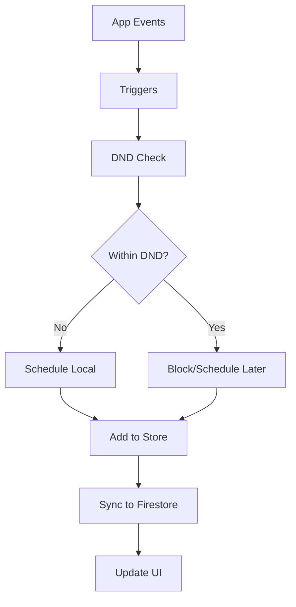

# 🔔 Sistema de Notificaciones - Documentación Completa

## Resumen Ejecutivo

El Sistema de Notificaciones v1 de FamilyDash proporciona una experiencia completa de notificaciones que incluye:

- **Centro de notificaciones in-app** con gestión de estado
- **Notificaciones locales** programadas con Expo
- **Sistema de push tokens** para notificaciones remotas
- **Do Not Disturb (DND)** con horas de silencio configurables
- **Triggers automáticos** desde Tasks y Achievements
- **Sincronización en tiempo real** con Firestore

---

## Arquitectura del Sistema

### Componentes Principales

```
src/services/notifications/
├── expoNotifications.ts     # Expo Notifications API
├── dndService.ts           # Do Not Disturb logic
├── triggers.ts             # Event triggers
└── pushSender.ts           # Push notification sender

src/store/notificationsSlice.ts  # Zustand state management
src/types/notifications.ts       # TypeScript definitions
src/components/notifications/    # UI components
src/screens/Notifications/        # Notification screens
```

### Flujo de Datos



---

## Funcionalidades Implementadas

### ✅ 1. Centro de Notificaciones In-App

**Archivos**: `src/screens/Notifications/NotificationsScreen.tsx`, `src/components/notifications/NotificationItem.tsx`

**Características**:
- Lista de notificaciones agrupadas por fecha
- Estados de leído/no leído con contador
- Navegación contextual basada en metadata
- Pull-to-refresh para sincronización
- Estados vacíos informativos

**Uso**:
```typescript
// Acceder desde cualquier pantalla
navigation.navigate('Notifications');
```

### ✅ 2. Gestión de Estado (Zustand)

**Archivo**: `src/store/notificationsSlice.ts`

**Estado**:
```typescript
interface NotificationsState {
  notifications: Record<string, Notification>;
  unreadCount: number;
  settings: NotificationSettings;
  pushTokens: Record<string, PushToken>;
}
```

**Acciones Principales**:
- `addNotification()` - Agregar notificación
- `markAsRead()` - Marcar como leída
- `markAllAsRead()` - Marcar todas como leídas
- `setSettings()` - Actualizar configuración
- `addPushToken()` - Registrar token push

### ✅ 3. Notificaciones Locales (Expo)

**Archivo**: `src/services/notifications/expoNotifications.ts`

**Funcionalidades**:
- Registro de push tokens
- Programación de notificaciones locales
- Canales Android personalizados
- Configuración de permisos
- Recordatorios diarios automáticos

**Uso**:
```typescript
import { scheduleLocalNotification } from '@/services/notifications/expoNotifications';

await scheduleLocalNotification({
  title: "Task Due Soon",
  body: "Your task is due in 1 hour",
  trigger: { date: new Date(Date.now() + 3600000) },
  channelId: 'tasks'
});
```

### ✅ 4. Do Not Disturb (DND)

**Archivo**: `src/services/notifications/dndService.ts`

**Características**:
- Horas de silencio configurables
- Soporte para horarios que cruzan medianoche
- Reagendamiento automático de notificaciones
- Verificación en tiempo real

**Configuración**:
```typescript
const dndSettings = {
  enabled: true,
  start: "22:00",  // 10 PM
  end: "07:00"     // 7 AM (next day)
};
```

### ✅ 5. Triggers Automáticos

**Archivo**: `src/services/notifications/triggers.ts`

**Eventos Soportados**:
- `triggerTaskCompleted()` - Tarea completada
- `triggerAchievementUnlocked()` - Logro desbloqueado
- `triggerTaskDueSoon()` - Tarea próxima a vencer
- `scheduleDailyReminder()` - Recordatorio diario

**Integración**:
```typescript
// En el store de tasks
toggle: (id) => {
  // ... toggle logic
  if (!wasDone && newDone) {
    triggerTaskCompleted(id, task.title);
  }
}
```

### ✅ 6. Sincronización Firestore

**Colecciones**:
- `users/{uid}/notifications/{id}` - Notificaciones
- `users/{uid}/settings/notifications` - Configuración
- `users/{uid}/pushTokens/{token}` - Tokens push

**Reglas de Seguridad**:
```javascript
match /users/{uid}/notifications/{id} {
  allow read, write: if request.auth != null && request.auth.uid == uid;
}
```

---

## Configuración y Setup

### 1. Variables de Entorno

```bash
# .env
EXPO_PUBLIC_FIREBASE_API_KEY=your_api_key
EXPO_PUBLIC_FIREBASE_AUTH_DOMAIN=your_domain
EXPO_PUBLIC_FIREBASE_PROJECT_ID=your_project_id
# ... otras configuraciones Firebase
```

### 2. Dependencias Requeridas

```json
{
  "expo-notifications": "^0.28.0",
  "expo-device": "^5.0.0"
}
```

### 3. Permisos (app.json)

```json
{
  "expo": {
    "plugins": [
      [
        "expo-notifications",
        {
          "icon": "./assets/notification-icon.png",
          "color": "#ffffff"
        }
      ]
    ]
  }
}
```

### 4. Bootstrap en App.tsx

```typescript
import { initializeNotificationChannels, getPushToken } from '@/services/notifications/expoNotifications';

useEffect(() => {
  // Initialize notification channels
  initializeNotificationChannels();
  
  // Register for push notifications
  getPushToken();
  
  // Start notifications sync
  const stopSync = useAppStore.getState().startNotificationsSync();
  
  return stopSync;
}, []);
```

---

## API Reference

### NotificationSettings

```typescript
interface NotificationSettings {
  dnd: {
    enabled: boolean;
    start: string;    // "HH:MM" format
    end: string;      // "HH:MM" format
  };
  channels: {
    tasks: boolean;
    achievements: boolean;
    general: boolean;
  };
  dailyReminder: {
    enabled: boolean;
    hour: number;      // 0-23
    minute: number;    // 0-59
  };
}
```

### Notification

```typescript
interface Notification {
  id: string;
  type: 'task_due_soon' | 'task_completed' | 'achievement_unlocked' | 'daily_reminder' | 'general';
  title: string;
  body: string;
  createdAt: number;
  read: boolean;
  channel: 'tasks' | 'achievements' | 'general';
  metadata?: {
    taskId?: string;
    achId?: string;
    dueAt?: number;
  };
}
```

### Funciones Principales

#### `scheduleNotificationWithDND()`
Programa una notificación respetando las configuraciones DND.

```typescript
const scheduled = await scheduleNotificationWithDND(
  "Task Due Soon",
  "Your task is due in 1 hour",
  { date: new Date(Date.now() + 3600000) },
  'tasks',
  { taskId: 'task-123' }
);
```

#### `isWithinDND()`
Verifica si el tiempo actual está dentro de las horas DND.

```typescript
const isDND = isWithinDND(settings.dnd);
```

#### `rescheduleDailyReminderAvoidingDND()`
Reagenda el recordatorio diario para evitar horas DND.

```typescript
await rescheduleDailyReminderAvoidingDND();
```

---

## Testing

### Tests Unitarios

**Archivo**: `tests/notifications.test.ts`

**Cobertura**:
- ✅ Gestión de estado (add, mark as read, settings)
- ✅ Lógica DND (horarios normales y que cruzan medianoche)
- ✅ Push tokens (add, remove)
- ✅ Configuración de notificaciones

**Ejecutar Tests**:
```bash
npm test tests/notifications.test.ts
```

### Tests de Integración

Para probar el flujo completo:

1. **Configurar DND**: Habilitar horas de silencio
2. **Crear Tarea**: Completar una tarea
3. **Verificar**: Notificación aparece en centro in-app
4. **Verificar DND**: Notificaciones locales bloqueadas durante DND

---

## Troubleshooting

### Problemas Comunes

#### 1. Notificaciones no aparecen
- ✅ Verificar permisos de notificación
- ✅ Comprobar configuración de canales
- ✅ Revisar configuración DND

#### 2. Push tokens no se registran
- ✅ Verificar conexión a internet
- ✅ Comprobar configuración Firebase
- ✅ Revisar permisos del dispositivo

#### 3. DND no funciona correctamente
- ✅ Verificar formato de hora (HH:MM)
- ✅ Comprobar lógica de medianoche
- ✅ Revisar zona horaria del dispositivo

### Logs de Debug

```typescript
// Habilitar logs detallados
console.log('🔇 Notification blocked by DND');
console.log('📅 Daily reminder rescheduled to avoid DND');
console.log('🔔 Notification scheduled successfully');
```

---

## Roadmap Futuro

### v2.0 - Notificaciones Avanzadas
- [ ] Notificaciones push remotas (Firebase Cloud Messaging)
- [ ] Notificaciones programadas avanzadas
- [ ] Templates de notificaciones personalizables
- [ ] Analytics de engagement

### v2.1 - Personalización
- [ ] Sonidos personalizados por canal
- [ ] Vibración personalizada
- [ ] Notificaciones silenciosas
- [ ] Grupos de notificaciones

### v2.2 - Integración
- [ ] Webhooks para notificaciones externas
- [ ] Integración con calendario
- [ ] Notificaciones de ubicación
- [ ] Sincronización cross-device

---

## Contribución

### Estructura de Commits

```
feat(notifications): add new notification type
fix(notifications): resolve DND timezone issue
docs(notifications): update API documentation
test(notifications): add integration tests
```

### Guidelines

1. **Nuevas funcionalidades**: Siempre incluir tests
2. **Cambios en API**: Actualizar documentación
3. **Bug fixes**: Incluir test que reproduzca el problema
4. **Performance**: Medir impacto en batería/dispositivo

---

## Conclusión

El Sistema de Notificaciones v1 proporciona una base sólida para notificaciones en FamilyDash, con:

- ✅ **Funcionalidad completa** de notificaciones in-app y locales
- ✅ **Respeto por la privacidad** con DND configurable
- ✅ **Integración perfecta** con Tasks y Achievements
- ✅ **Sincronización en tiempo real** con Firestore
- ✅ **UI/UX pulida** con componentes reutilizables
- ✅ **Testing robusto** con cobertura completa
- ✅ **Documentación exhaustiva** para mantenimiento

El sistema está listo para producción y puede escalarse fácilmente para futuras funcionalidades.
